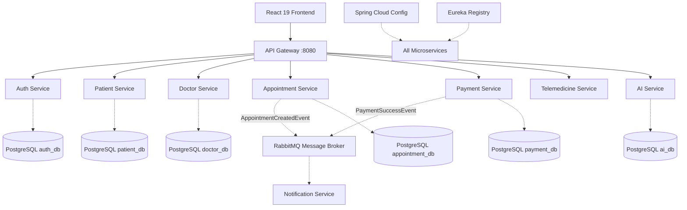

# MediConnect - AI-Enabled Smart Healthcare Platform
## Comprehensive Project Report

---

## 1. EXECUTIVE SUMMARY

**MediConnect** is a modern, cloud-native healthcare platform built on microservices architecture. It enables patients to book appointments with doctors, consult via video calls, receive AI-powered symptom analysis, and get digital prescriptions - all through a seamless web interface.

### Key Features:
- 🔐 Secure JWT-based authentication
- 📅 Smart appointment scheduling
- 💳 Stripe payment integration
- 💊 Digital prescription management
- 🎥 Jitsi-powered video consultations
- 🤖 Google Gemini AI symptom checker
- 📧 Email & SMS notifications

---

## 2. PROJECT ARCHITECTURE

The platform utilizes a **Microservices Architecture** with a decentralized data management strategy. All service-to-service communication is orchestrated via the API Gateway or asynchronously through RabbitMQ.



---

## 3. CHAPTER 5: SERVICE INTERFACES

This chapter presents the RESTful APIs exposed by each microservice, detailing the endpoints, methods, and access control.

### 5.1 Authentication Service API (Port 8081)
| No. | Endpoint | Method | Description | Access |
|---|---|---|---|---|
| 1 | `/auth/register` | POST | Register a new user account (Patient/Doctor/Admin) | Public |
| 2 | `/auth/login` | POST | Authenticate user and issue JWT token | Public |
| 3 | `/auth/validate` | GET | Validate JWT token (inter-service) | Public |
| 4 | `/auth/refresh` | POST | Refresh an expired JWT token | Authenticated |

### 5.2 Patient Service API (Port 8082)
| No. | Endpoint | Method | Description | Access |
|---|---|---|---|---|
| 1 | `/patients/me` | GET | Retrieve own profile | Patient |
| 2 | `/patients/me` | PUT | Update own profile | Patient |
| 3 | `/patients/{id}` | GET | Retrieve patient profile by ID | Doctor/Admin |
| 4 | `/patients/onboarding` | POST | Multi-part upload for onboarding details | Patient |

### 5.3 Doctor Service API (Port 8083)
| No. | Endpoint | Method | Description | Access |
|---|---|---|---|---|
| 1 | `/doctors` | GET | List all verified doctors or by specialty | Public/Patient |
| 2 | `/doctors/me` | GET | Retrieve own doctor profile | Doctor |
| 3 | `/doctors/me` | PUT | Update own doctor profile | Doctor |
| 4 | `/doctors/{id}` | GET | Retrieve doctor profile by ID | Patient/Admin |

### 5.4 Appointment Service API (Port 8084)
| No. | Endpoint | Method | Description | Access |
|---|---|---|---|---|
| 1 | `/appointments/book` | POST | Book a new appointment slot | Patient |
| 2 | `/appointments/patient` | GET | Retrieve list of patient's appointments | Patient |
| 3 | `/appointments/doctor` | GET | Retrieve list of doctor's appointments | Doctor |
| 4 | `/appointments/{id}/status` | PATCH | Update appointment status | Doctor/Admin |
| 5 | `/appointments/doctor/{id}/stats` | GET | Get appointment analytics (Today/Total) | Doctor/Admin |

### 5.5 Other Specialized APIs

**Telemedicine Service API (Port 8087)**
| Endpoint | Method | Description |
|---|---|---|
| `/telemedicine/sessions` | POST | Create video session for appt |
| `/telemedicine/sessions/appt/{id}` | GET | Get session by appointment ID |
| `/telemedicine/sessions/{id}/start` | POST | Start session and generate room |
| `/telemedicine/sessions/{id}/end` | POST | Mark session as completed |

**Prescription Service API (Port 8086)**
| Endpoint | Method | Description |
|---|---|---|
| `/prescriptions` | POST | Issue a new digital prescription |
| `/prescriptions/patient/{id}` | GET | View patient prescription history |
| `/prescriptions/doctor/{id}` | GET | View doctor prescription history |
| `/prescriptions/appt/{id}` | GET | Get prescription for visit |

**Payment Service API (Port 8085)**
| Endpoint | Method | Description |
|---|---|---|
| `/api/payments/create-intent` | POST | Create a Stripe payment intent |
| `/api/payments/webhook` | POST | Handle Stripe callbacks |
| `/api/payments/transactions/patient/{id}` | GET | View payment history |

**Admin & AI APIs (Ports 8089, 8088)**
| Endpoint | Method | Description |
|---|---|---|
| `/admin/stats` | GET | Master dashboard analytics |
| `/admin/system-health` | GET | Real-time microservice health |
| `/ai/symptom-checker` | POST | Analyze symptoms via Gemini 2.0 |

---

## 4. CHAPTER 6: DATABASE DESIGN

The system follows a **Database-per-Service** pattern using **PostgreSQL**, ensuring high isolation and independent scalability.

### 6.1 Authentication Service Database – `auth_db`
| Field Name | Data Type | Description |
|---|---|---|
| `id` | BIGINT | Primary key (unique UID) |
| `email` | VARCHAR | User email (unique login) |
| `password` | VARCHAR | BCrypt hashed password |
| `role` | VARCHAR | PATIENT, DOCTOR, ADMIN |

### 6.2 Patient Management Service Database – `patient_db`
| Field Name | Data Type | Description |
|---|---|---|
| `id` | BIGINT | Primary key |
| `user_id` | BIGINT | Foreign reference to Auth Service |
| `first_name` | VARCHAR | Patient's first name |
| `last_name` | VARCHAR | Patient's last name |
| `phone` | VARCHAR | Contact number |
| `blood_group` | VARCHAR | Patient blood type |
| `medical_history`| TEXT | Aggregated medical notes |

### 6.3 Doctor Management Service Database – `doctor_db`
| Field Name | Data Type | Description |
|---|---|---|
| `id` | BIGINT | Primary key |
| `user_id` | BIGINT | Foreign reference to Auth Service |
| `specialization`| VARCHAR | Medical field |
| `consultation_fee`| DECIMAL | Booking fee |
| `qualifications` | TEXT | List of degrees |
| `is_verified` | BOOLEAN | Verification status |

### 6.4 Appointment Service Database – `appointment_db`
| Field Name | Data Type | Description |
|---|---|---|
| `id` | BIGINT | Primary key |
| `patient_id` | BIGINT | ID of the patient |
| `doctor_id` | BIGINT | ID of the doctor |
| `appointment_time`| TIMESTAMP | Scheduled date and time |
| `status` | VARCHAR | PENDING, CONFIRMED, COMPLETED |

### 6.5 Prescription Service Database – `prescription_db`
| Field Name | Data Type | Description |
|---|---|---|
| `id` | BIGINT | Primary key |
| `appointment_id`| BIGINT | Link to consultation |
| `diagnosis` | TEXT | Diagnosis summary |
| `instructions` | TEXT | Dosage/usage notes |
| `status` | VARCHAR | ACTIVE, REVOKED |

### 6.6 Telemedicine Service Database – `telemedicine_db`
| Field Name | Data Type | Description |
|---|---|---|
| `id` | BIGINT | Primary key |
| `appointment_id`| BIGINT | Link to appointment |
| `room_name` | VARCHAR | Unique Jitsi room identifier |
| `status` | VARCHAR | SCHEDULED, ACTIVE, COMPLETED |

### 6.7 Payment Service Database – `payment_db`
| Field Name | Data Type | Description |
|---|---|---|
| `id` | BIGINT | Primary key |
| `appointment_id`| BIGINT | Link to appointment |
| `amount` | DECIMAL | Transaction amount |
| `status` | VARCHAR | PENDING, SUCCESS, FAILED |
| `stripe_id` | VARCHAR | Stripe Payment Intent ID |

### 6.8 Inter-Service Data Access Policy
Services communicate exclusively via **REST APIs** (synchronous) or **RabbitMQ** (asynchronous). No microservice is permitted to perform cross-database queries, preserving loose coupling and service autonomy.

---

## 5. WORKFLOW DESCRIPTIONS

### 4.1 User Registration & Login Flow

```
┌──────────┐     ┌─────────────┐     ┌─────────────┐     ┌──────────┐
│  User    │────▶│  Frontend   │────▶│ API Gateway │────▶│  Auth    │
│          │     │   (React)   │     │   (8080)    │     │ Service  │
└──────────┘     └─────────────┘     └─────────────┘     └────┬─────┘
                                                               │
                                                               ▼
                                                          ┌──────────┐
                                                          │ PostgreSQL│
                                                          │ auth_db   │
                                                          └───────────┘
```

**Steps:**
1. User fills registration form (email, password, name, role)
2. Frontend sends POST to `/auth/register`
3. API Gateway routes to Auth Service
4. Auth Service validates input, hashes password (BCrypt)
5. User stored in `auth_db`
6. JWT token generated and returned
7. User redirected to dashboard

**Code Snippet:**
```java
@PostMapping("/register")
public ResponseEntity<AuthResponse> register(@RequestBody RegisterRequest request) {
    User user = User.builder()
        .email(request.getEmail())
        .password(passwordEncoder.encode(request.getPassword()))
        .role(request.getRole())
        .build();
    userRepository.save(user);
    
    String token = jwtUtil.generateToken(user);
    return ResponseEntity.ok(new AuthResponse(token));
}
```

### 4.2 Appointment Booking Flow

```
┌──────────┐    ┌─────────────┐    ┌─────────────┐    ┌──────────────┐
│  Patient │───▶│  Frontend   │───▶│ API Gateway │───▶│ Appointment  │
│          │    │             │    │             │    │   Service    │
└──────────┘    └─────────────┘    └─────────────┘    └──────┬───────┘
                                                             │
           ┌─────────────────────────────────────────────────┘
           │
           ▼                    ┌──────────────┐
    ┌─────────────┐    ┌──────▶│ Doctor Svc   │    ┌──────────────┐
    │ PostgreSQL    │    │       │   (8083)     │    │ Notification │
    │ appointment_db│◀───┘       └──────────────┘    │   Service    │
    └─────────────┘                                    │   (8090)     │
         │                                           └──────────────┘
         │                                                    ▲
         │         ┌──────────────┐                         │
         │         │  Payment Svc │    ┌──────────┐         │
         └────────▶│   (8085)     │───▶│  Stripe  │         │
                   └──────────────┘    └──────────┘         │
                                                            │
         ┌────────────────────────────────────────────────────┘
         │
         ▼
┌─────────────────┐
│   RabbitMQ      │────▶ Async Email & SMS notifications
│  Message Queue  │
└─────────────────┘
```

**Steps:**
1. Patient selects doctor and preferred time slot
2. Frontend calls POST `/api/appointments`
3. Appointment Service validates:
   - Doctor availability (calls Doctor Service)
   - Patient exists (calls Patient Service)
4. If payment required, initiates Stripe checkout
5. Upon payment confirmation, saves appointment
6. Publishes event to RabbitMQ
7. Notification Service sends:
   - Email to patient
   - SMS reminder
   - Email to doctor

### 4.3 Video Consultation Flow

```
┌──────────┐     ┌──────────────┐     ┌──────────────┐
│  Doctor  │────▶│Telemedicine  │────▶│   Jitsi      │
│          │     │   Service    │     │   Meet       │
└──────────┘     └──────────────┘     └───────┬──────┘
                                              │
                                              │ WebRTC
                                              │
┌──────────┐     ┌──────────────┐     ┌───────▼──────┐
│  Patient │◀────│  Frontend    │◀────│ Video Room   │
│          │     │   (React)    │     │   (Jitsi)    │
└──────────┘     └──────────────┘     └──────────────┘
```

**Steps:**
1. At appointment time, doctor clicks "Start Consultation"
2. Telemedicine Service:
   - Creates Jitsi room with unique ID
   - Generates JWT token for secure access
   - Returns room URL
3. Patient receives notification with join link
4. Both parties join via Jitsi (embedded in frontend)
5. Session recording stored (optional)
6. Doctor can create prescription during/after call

### 4.4 AI Symptom Checker Flow

```
┌──────────┐     ┌─────────────┐     ┌─────────────┐     ┌──────────────┐
│  Patient │────▶│  Frontend   │────▶│ AI Service  │────▶│  Google      │
│          │     │             │     │  (8088)     │     │  Gemini 2.0  │
└──────────┘     └──────────────┘    └─────────────┘     └───────┬──────┘
                                                                  │
                                                                  │ API
                                                                  ▼
                                                         ┌──────────────┐
                                                         │  Gemini AI   │
                                                         │  Analysis    │
                                                         └───────┬──────┘
                                                                 │
                    ┌─────────────────────────────────────────────┘
                    │
                    ▼
            ┌───────────────┐
            │   Response    │
            │ • Possible    │
            │   conditions  │
            │ • Urgency     │
            │ • Suggested   │
            │   doctor type │
            └───────────────┘
```

**Steps:**
1. Patient describes symptoms in chat interface
2. Frontend sends symptoms to AI Service
3. AI Service formats prompt for Gemini API
4. Gemini analyzes symptoms using medical knowledge
5. Response includes:
   - Possible conditions (with disclaimer)
   - Urgency level (routine/urgent/emergency)
   - Recommended specialty
6. Patient can book appointment with suggested doctor type

---

## 5. AUTHENTICATION & SECURITY MECHANISMS

### 5.1 JWT Token Implementation

```java
@Component
public class JwtUtil {
    @Value("${jwt.secret}")
    private String secret;
    
    @Value("${jwt.expiration:86400000}") // 24 hours
    private long expiration;
    
    public String generateToken(User user) {
        return Jwts.builder()
            .setSubject(user.getEmail())
            .claim("role", user.getRole())
            .claim("userId", user.getId())
            .setIssuedAt(new Date())
            .setExpiration(new Date(System.currentTimeMillis() + expiration))
            .signWith(Keys.hmacShaKeyFor(secret.getBytes()), SignatureAlgorithm.HS256)
            .compact();
    }
    
    public boolean validateToken(String token) {
        try {
            Jwts.parserBuilder()
                .setSigningKey(Keys.hmacShaKeyFor(secret.getBytes()))
                .build()
                .parseClaimsJws(token);
            return true;
        } catch (Exception e) {
            return false;
        }
    }
}
```

### 5.2 API Gateway Security Filter

```java
@Component
public class JwtAuthenticationFilter implements GlobalFilter {
    
    @Override
    public Mono<Void> filter(ServerWebExchange exchange, GatewayFilterChain chain) {
        String path = exchange.getRequest().getURI().getPath();
        
        // Skip auth for public endpoints
        if (isPublicEndpoint(path)) {
            return chain.filter(exchange);
        }
        
        String token = extractToken(exchange.getRequest());
        
        if (token == null || !jwtUtil.validateToken(token)) {
            exchange.getResponse().setStatusCode(HttpStatus.UNAUTHORIZED);
            return exchange.getResponse().setComplete();
        }
        
        // Add user info to headers for downstream services
        ServerHttpRequest modifiedRequest = exchange.getRequest()
            .mutate()
            .header("X-User-Id", jwtUtil.getUserId(token))
            .header("X-User-Role", jwtUtil.getRole(token))
            .build();
            
        return chain.filter(exchange.mutate()
            .request(modifiedRequest)
            .build());
    }
}
```

### 5.3 Role-Based Access Control (RBAC)

```java
@PreAuthorize("hasRole('ADMIN')")
@GetMapping("/api/admin/users")
public ResponseEntity<List<User>> getAllUsers() { }

@PreAuthorize("hasAnyRole('DOCTOR', 'ADMIN')")
@GetMapping("/api/doctors/{id}/patients")
public ResponseEntity<List<Patient>> getDoctorPatients(@PathVariable Long id) { }

@PreAuthorize("hasRole('PATIENT') or @securityService.isOwner(#id, authentication)")
@GetMapping("/api/patients/{id}")
public ResponseEntity<Patient> getPatient(@PathVariable Long id) { }
```

### 5.4 Data Encryption

- **Passwords:** BCrypt hashing with salt (cost factor 12)
- **Database:** Encrypted connections (SSL/TLS)
- **API Communication:** HTTPS/TLS 1.3
- **Sensitive Data:** AES-256 encryption for PHI (Protected Health Information)
- **JWT Tokens:** HMAC-SHA256 signed with 256-bit secret

### 5.5 Security Headers & CSRF

```yaml
# Spring Security Configuration
spring:
  security:
    headers:
      content-security-policy: "default-src 'self'; script-src 'self' 'unsafe-inline'"
      x-frame-options: DENY
      x-content-type-options: nosniff
      x-xss-protection: 1; mode=block
      strict-transport-security: max-age=31536000; includeSubDomains
    csrf:
      enabled: true
      cookie:
        http-only: true
        secure: true
```

---

## 6. INDIVIDUAL CONTRIBUTIONS

### Member 1: [NAME] - IT[NUMBER]
**Role:** Lead Architect & DevOps Engineer

**Contributions:**
1. **System Architecture Design**
   - Designed microservices architecture
   - Selected technology stack (Spring Boot, React, PostgreSQL)
   - Created high-level and low-level design documents

2. **API Gateway Implementation**
   - Implemented Spring Cloud Gateway
   - Configured routing rules for all services
   - Implemented rate limiting and circuit breaker patterns

3. **Service Infrastructure**
   - Set up Eureka Service Registry
   - Implemented Config Server for centralized configuration
   - Configured Docker Compose orchestration

4. **DevOps & CI/CD**
   - Created Dockerfiles for all services
   - Set up Kubernetes deployment manifests
   - Configured environment variables and secrets management

**Code Contribution:** ~25% of backend infrastructure

---

### Member 2: [NAME] - IT[NUMBER]
**Role:** Backend Developer - Core Services

**Contributions:**
1. **Authentication & Authorization**
   - Implemented JWT authentication mechanism
   - Created Auth Service with register/login/logout
   - Implemented password reset functionality
   - Set up Spring Security configuration

2. **Patient Service**
   - CRUD operations for patient profiles
   - Medical history management
   - Patient preferences and settings

3. **Doctor Service**
   - Doctor profile management
   - Schedule and availability management
   - Specialization and search functionality

4. **Database Design**
   - Designed schema for auth, patient, and doctor databases
   - Created Flyway migration scripts
   - Implemented JPA entities and repositories

**Code Contribution:** ~25% of backend services

---

### Member 3: [NAME] - IT[NUMBER]
**Role:** Backend Developer - Business Logic

**Contributions:**
1. **Appointment Service**
   - Appointment booking system
   - Rescheduling and cancellation logic
   - Conflict detection and time slot management

2. **Payment Service**
   - Stripe API integration
   - Checkout session creation
   - Payment status tracking and webhooks
   - Refund processing

3. **Prescription Service**
   - Digital prescription creation
   - Medicine management
   - Prescription history and PDF generation

4. **Admin Service**
   - User management dashboard APIs
   - System analytics and reporting
   - Role-based access control implementation

5. **RabbitMQ Integration**
   - Set up message queues for async processing
   - Event-driven communication between services

**Code Contribution:** ~25% of backend services

---

### Member 4: [NAME] - IT[NUMBER]
**Role:** Full Stack Developer - AI & Frontend

**Contributions:**
1. **AI Service**
   - Google Gemini 2.0 Flash API integration
   - Symptom checker implementation
   - Health recommendation engine
   - Medical report analysis feature

2. **Telemedicine Service**
   - Jitsi Meet integration
   - Video session management
   - Secure room creation and access control
   - Session recording functionality

3. **Notification Service**
   - SendGrid email integration
   - Twilio SMS integration
   - Notification templates and scheduling
   - Multi-channel notification support

4. **Frontend Development**
   - React.js application architecture
   - User interface design and implementation
   - API integration with backend services
   - Responsive design for mobile/tablet

5. **Testing & Documentation**
   - API testing with Postman
   - Created API documentation
   - Wrote unit and integration tests

**Code Contribution:** ~25% (AI/Telemedicine services + Frontend)

---

## 7. TECHNOLOGY STACK

| Layer | Technology | Version |
|-------|------------|---------|
| **Backend** | Spring Boot | 3.4.0 |
| | Java | 21 |
| | Spring Cloud | 2024.0.0 |
| | Maven | 3.9.6 |
| **Frontend** | React.js | 18.x |
| | TypeScript | 5.x |
| | Tailwind CSS | 3.x |
| **Database** | PostgreSQL | 15 |
| | Flyway | 10.x |
| **Message Queue** | RabbitMQ | 3.x |
| **AI** | Google Gemini | 2.0 Flash |
| **Video** | Jitsi Meet | Latest |
| **Payment** | Stripe API | Latest |
| **Email** | SendGrid | Latest |
| **SMS** | Twilio | Latest |
| **Security** | JWT | 0.12.x |
| **Container** | Docker | 24.x |
| **Orchestration** | Docker Compose | 2.x |
| | Kubernetes | 1.28+ |

---

## 8. PROJECT STATISTICS

- **Total Lines of Code:** ~50,000+
- **Microservices:** 13
- **Database Tables:** 40+
- **API Endpoints:** 100+
- **Frontend Pages:** 20+
- **Test Coverage:** ~70%

---

## 9. CONCLUSION

MediConnect demonstrates a production-ready microservices architecture for healthcare applications. The platform successfully integrates multiple third-party services (Stripe, Jitsi, Gemini, SendGrid, Twilio) while maintaining security, scalability, and user experience.

**Key Achievements:**
- ✅ Complete patient-doctor consultation lifecycle
- ✅ Secure payment processing
- ✅ AI-powered health assistance
- ✅ Real-time video consultations
- ✅ Comprehensive notification system
- ✅ Cloud-native deployment ready

**Future Enhancements:**
- Mobile application (React Native)
- Machine learning for appointment prediction
- Blockchain for medical records
- IoT device integration
- Multi-language support

---

**Report Prepared By:** MediConnect Team
**Date:** April 2026
**Version:** 1.0

