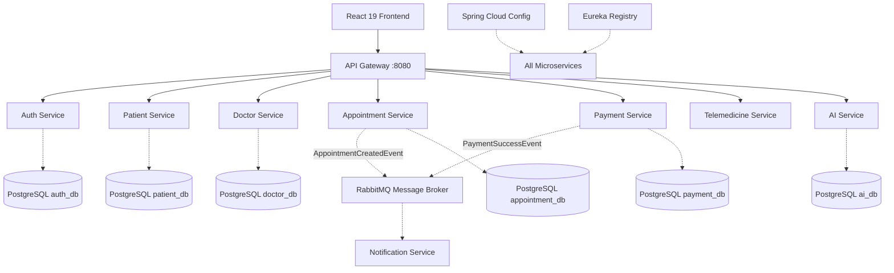

# MediConnect Lanka - Report Material

Copy and paste these sections into your final assignment report.

## 1. High-Level Architecture Diagram
*(Render this using Mermaid Live Editor or embed directly into markdown if your processor supports it)*

## 2. Work Division & Individual Contributions

This project was developed by 3 team members, balancing the workload across Frontend, Backend, and Infrastructure.

| Team Member | Functional Domain | Technical Ownership |
| :--- | :--- | :--- |
| **Member 1** | **Patient Facing & Core Auth** | **Frontend:** Overarching React setup, Vite Config, Tailwind/shadcn setup, Patient Dashboard. **Backend:** `auth-service`, `patient-service`, Gateway Routing. **DB:** `auth_db`, `patient_db`. |
| **Member 2** | **Core Medical & Telemedicine** | **Frontend:** Doctor Dashboard, Booking Workflow, Jitsi Video UI. **Backend:** `doctor-service`, `appointment-service`, `telemedicine-service`. **Inter-service:** Feign Client Integrations. |
| **Member 3** | **Platform Services & DevOps** | **Frontend:** Admin Dashboard, AI Symptom Checker UI, Payment Flow. **Backend:** `payment-service`, `notification-service`, `ai-service`, Eureka Service Registry, Config Server. **Infra:** Docker Compose, Kubernetes Manifests, RabbitMQ Queues. |

## 3. Chapter 5: Service Interfaces

This chapter presents the RESTful APIs exposed by each microservice, detailing the endpoints, methods, and access control.

### 5.1 Authentication Service API
| No. | Endpoint | Method | Description | Access |
|---|---|---|---|---|
| 1 | `/auth/register` | POST | Register a new user account (Patient/Doctor/Admin) | Public |
| 2 | `/auth/login` | POST | Authenticate user and issue JWT token | Public |
| 3 | `/auth/validate` | GET | Validate JWT token (inter-service) | Public |
| 4 | `/auth/refresh` | POST | Refresh an expired JWT token | Authenticated |

### 5.2 Patient Service API
| No. | Endpoint | Method | Description | Access |
|---|---|---|---|---|
| 1 | `/patients/me` | GET | Retrieve own profile | Patient |
| 2 | `/patients/me` | PUT | Update own profile | Patient |
| 3 | `/patients/{id}` | GET | Retrieve patient profile by ID | Doctor/Admin |
| 4 | `/patients/onboarding` | POST | Multi-part upload for onboarding details | Patient |

### 5.3 Doctor Service API
| No. | Endpoint | Method | Description | Access |
|---|---|---|---|---|
| 1 | `/doctors` | GET | List all verified doctors or by specialty | Public/Patient |
| 2 | `/doctors/me` | GET | Retrieve own doctor profile | Doctor |
| 3 | `/doctors/me` | PUT | Update own doctor profile | Doctor |
| 4 | `/doctors/{id}` | GET | Retrieve doctor profile by ID | Patient/Admin |

### 5.4 Appointment Service API
| No. | Endpoint | Method | Description | Access |
|---|---|---|---|---|
| 1 | `/appointments/book` | POST | Book a new appointment slot | Patient |
| 2 | `/appointments/patient` | GET | Retrieve list of patient's appointments | Patient |
| 3 | `/appointments/doctor` | GET | Retrieve list of doctor's appointments | Doctor |
| 4 | `/appointments/{id}/status` | PATCH | Update appointment status | Doctor/Admin |
| 5 | `/appointments/doctor/{id}/stats` | GET | Get appointment analytics (Today/Total) | Doctor/Admin |

### 5.5 Telemedicine, Prescription, Payment, Admin, and AI APIs

**Telemedicine Service API**
| Endpoint | Method | Description |
|---|---|---|
| `/telemedicine/sessions` | POST | Create video session for appt |
| `/telemedicine/sessions/appt/{id}` | GET | Get session by appointment ID |
| `/telemedicine/sessions/{id}/start` | POST | Start session and generate room |
| `/telemedicine/sessions/{id}/end` | POST | Mark session as completed |

**Prescription Service API**
| Endpoint | Method | Description |
|---|---|---|
| `/prescriptions` | POST | Issue a new digital prescription |
| `/prescriptions/patient/{id}` | GET | View patient prescription history |
| `/prescriptions/doctor/{id}` | GET | View doctor prescription history |
| `/prescriptions/appt/{id}` | GET | Get prescription for visit |

**Payment Service API**
| Endpoint | Method | Description |
|---|---|---|
| `/api/payments/create-intent` | POST | Create a Stripe payment intent |
| `/api/payments/webhook` | POST | Handle Stripe callbacks |
| `/api/payments/transactions/patient/{id}` | GET | View payment history |

**Admin & AI APIs**
| Endpoint | Method | Description |
|---|---|---|
| `/admin/stats` | GET | Master dashboard analytics |
| `/admin/system-health` | GET | Real-time microservice health |
| `/ai/symptom-checker` | POST | Analyze symptoms via Gemini 2.0 |

---

## 4. Chapter 6: Database Design

The system follows a **Database-per-Service** pattern using **PostgreSQL**, ensuring high isolation and independent scalability.

### 6.1 Authentication Service Database – `auth_db`
| Field Name | Data Type | Description |
|---|---|---|
| `id` | BIGINT | Primary key (unique UID) |
| `email` | VARCHAR | User email (unique login) |
| `password` | VARCHAR | BCrypt hashed password |
| `role` | VARCHAR | PATIENT, DOCTOR, ADMIN |

### 6.2 Patient Management Service Database – `patient_db`
| Field Name | Data Type | Description |
|---|---|---|
| `id` | BIGINT | Primary key |
| `user_id` | BIGINT | Foreign reference to Auth Service |
| `first_name` | VARCHAR | Patient's first name |
| `last_name` | VARCHAR | Patient's last name |
| `phone` | VARCHAR | Contact number |
| `blood_group` | VARCHAR | Patient blood type |
| `medical_history`| TEXT | Aggregated medical notes |

### 6.3 Doctor Management Service Database – `doctor_db`
| Field Name | Data Type | Description |
|---|---|---|
| `id` | BIGINT | Primary key |
| `user_id` | BIGINT | Foreign reference to Auth Service |
| `specialization`| VARCHAR | Medical field |
| `consultation_fee`| DECIMAL | Booking fee |
| `qualifications` | TEXT | List of degrees |
| `is_verified` | BOOLEAN | Verification status |

### 6.4 Appointment Service Database – `appointment_db`
| Field Name | Data Type | Description |
|---|---|---|
| `id` | BIGINT | Primary key |
| `patient_id` | BIGINT | ID of the patient |
| `doctor_id` | BIGINT | ID of the doctor |
| `appointment_time`| TIMESTAMP | Scheduled date and time |
| `status` | VARCHAR | PENDING, CONFIRMED, COMPLETED |

### 6.5 Prescription Service Database – `prescription_db`
| Field Name | Data Type | Description |
|---|---|---|
| `id` | BIGINT | Primary key |
| `appointment_id`| BIGINT | Link to consultation |
| `diagnosis` | TEXT | Diagnosis summary |
| `instructions` | TEXT | Dosage/usage notes |
| `status` | VARCHAR | ACTIVE, REVOKED |

### 6.6 Telemedicine Service Database – `telemedicine_db`
| Field Name | Data Type | Description |
|---|---|---|
| `id` | BIGINT | Primary key |
| `appointment_id`| BIGINT | Link to appointment |
| `room_name` | VARCHAR | Unique Jitsi room identifier |
| `status` | VARCHAR | SCHEDULED, ACTIVE, COMPLETED |

### 6.7 Payment Service Database – `payment_db`
| Field Name | Data Type | Description |
|---|---|---|
| `id` | BIGINT | Primary key |
| `appointment_id`| BIGINT | Link to appointment |
| `amount` | DECIMAL | Transaction amount |
| `status` | VARCHAR | PENDING, SUCCESS, FAILED |
| `stripe_id` | VARCHAR | Stripe Payment Intent ID |

### 6.8 Inter-Service Data Access Policy
Services communicate exclusively via **REST APIs** (synchronous) or **RabbitMQ** (asynchronous). No microservice is permitted to perform cross-database queries, preserving loose coupling and service autonomy.
