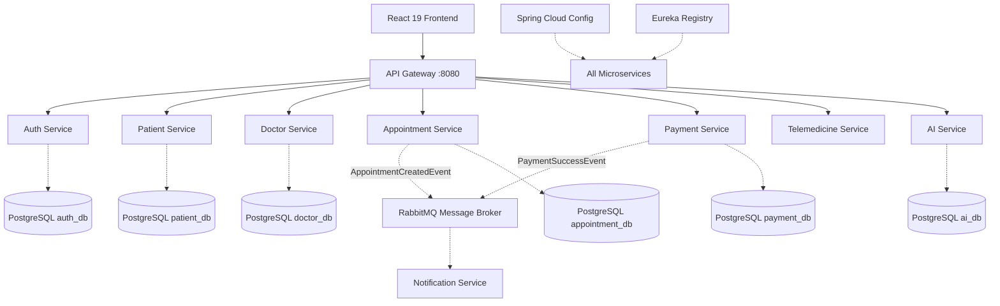

# MediConnect Lanka - Report Material

Copy and paste these sections into your final assignment report.

## 1. High-Level Architecture Diagram
*(Render this using Mermaid Live Editor or embed directly into markdown if your processor supports it)*

## 2. Work Division & Individual Contributions

This project was developed by 3 team members, balancing the workload across Frontend, Backend, and Infrastructure.

| Team Member | Functional Domain | Technical Ownership |
| :--- | :--- | :--- |
| **Member 1** | **Patient Facing & Core Auth** | **Frontend:** Overarching React setup, Vite Config, Tailwind/shadcn setup, Patient Dashboard. **Backend:** `auth-service`, `patient-service`, Gateway Routing. **DB:** `auth_db`, `patient_db`. |
| **Member 2** | **Core Medical & Telemedicine** | **Frontend:** Doctor Dashboard, Booking Workflow, Jitsi Video UI. **Backend:** `doctor-service`, `appointment-service`, `telemedicine-service`. **Inter-service:** Feign Client Integrations. |
| **Member 3** | **Platform Services & DevOps** | **Frontend:** Admin Dashboard, AI Symptom Checker UI, Payment Flow. **Backend:** `payment-service`, `notification-service`, `ai-service`, Eureka Service Registry, Config Server. **Infra:** Docker Compose, Kubernetes Manifests, RabbitMQ Queues. |

## 3. List of Key Microservice Interfaces (API Endpoints)

*All internal ports are proxied via `localhost:8080` (API Gateway) using the `/service-name/**` prefix context pattern.*

**Auth Service**
* `POST /auth/register` - Registers a new Patient, Doctor, or Admin.
* `POST /auth/login` - Authenticates user and generates JWT.
* `GET /auth/validate` - Core authentication verification hook for inter-service security.

**Patient Service**
* `GET /patients/{id}` - Retrieves complete patient healthcare profile & medical history.
* `PUT /patients/{id}` - Updates patient profile.

**Doctor Service**
* `GET /doctors` - Lists available doctors (searchable by `?specialization=xxx`).
* `GET /doctors/{id}` - Retrieves doctor credentials, availability, and fee details.
* `PUT /doctors/{id}` - Updates doctor availability slots.

**Appointment Service**
* `POST /appointments` - Books a preliminary appointment and generates Jitsi meet link.
* `GET /appointments/patient/{patientId}` - Lists appointment history for a patient.
* `GET /appointments/doctor/{doctorId}` - Lists scheduled sessions for a doctor.
* `PATCH /appointments/{id}/status` - Updates state (PENDING -> CONFIRMED).

**Telemedicine Service**
* `GET /telemedicine/generate-room` - Invoked dynamically to provision a Jitsi meeting.

**Payment Service**
* `POST /payments/notify` - Webhook hook for PayHere to report transaction fulfillment.

**AI Service**
* `POST /ai/symptom-checker` - Submits symptoms JSON to local wrapper which queries Gemini for preliminary analysis.

## 4. Main Workflows

**1. Booking Workflow:** A Patient browses available doctors fetched from `doctor-service`. They select a slot and invoke `POST /appointments`. The `appointment-service` creates a record in `PENDING` state and emits an `AppointmentCreatedEvent` to RabbitMQ. The `notification-service` consumes this and emails the patient.

**2. Video Consultation Workflow:** When an appointment reaches its designated time, the frontend embeds the Jitsi API iframe using the `meetingLink` generated during booking. It seamlessly joins both the Patient and Doctor into an isolated room using UUIDs generated by `telemedicine-service`.

**3. Async Notification Workflow:** To avoid blocking the HTTP threads during payment confirmation or booking, services drop string payloads to `notification_queue` via RabbitMQ. The single resilient `notification-service` handles 3rd-party network failures by retrying Notify.lk/Brevo API calls in isolation.

## 5. Authentication & Security Details
* **Technology:** JWT (JSON Web Tokens) with Spring Security.
* **Flow:** 
  1. Client sends credentials to `auth-service`.
  2. `auth-service` issues a JWT containing `{ userId, role, exp }`.
  3. Client attaches JWT as `Bearer` token to standard requests.
  4. Services validate this token on protected routes using standard JWT decoders or via Api Gateway security filters.
* **Roles:** 
  - `PATIENT`: Can manage own profile, book appointments.
  - `DOCTOR`: Can accept appointments, view assigned patients. (Requires Admin verification upon signup).
  - `ADMIN`: Global overview.
