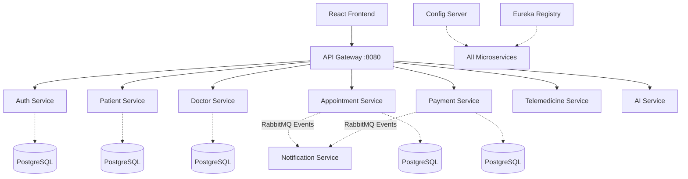

# MediConnect Lanka - Implementation Plan

This document outlines the complete technical design, work division, and execution steps for building the **MediConnect Lanka** AI-Enabled Smart Healthcare Appointment & Telemedicine Platform.

## 1. Work Division Table (For 3 Members)

Here is the balanced work division ensuring each member covers a substantial mix of frontend, backend, and infrastructure tasks:

| Team Member | Domain | Assigned Responsibilities | Report Submission Requirements |
| :--- | :--- | :--- | :--- |
| **Member 1** | **Patient Facing & Core Auth** | **Frontend:** Overarching React setup, Patient Dashboard, Auth pages.<br>**Backend:** `auth-service`, `patient-service`, routing logic in `api-gateway`. | Auth flow diagrams, Patient Service endpoints, API Gateway routing logic, Frontend Patient UI/UX screenshots. |
| **Member 2** | **Core Medical & Telemedicine**| **Frontend:** Doctor Dashboard, Booking flow, Video consultation UI.<br>**Backend:** `doctor-service`, `appointment-service`, `telemedicine-service`. | Appointment booking sequence diagram, Telemedicine integration details, Doctor UI screenshots. |
| **Member 3** | **Platform Services & DevOps** | **Frontend:** Admin Dashboard, AI Symptom Checker UI, Payment UI.<br>**Backend:** `payment-service`, `notification-service`, `ai-service`, `config-server`, `service-registry`.<br>**Infra:** Docker Compose, Kubernetes YAMLs. | Microservices overall architecture diagram, K8s deployment plan, Event-driven architecture (RabbitMQ), AI & Payment integration details. |

## 2. High-Level Architecture



## 3. Monorepo Folder Structure

```text
/Healthcare_Platform
├── docker-compose.yml
├── .env.example
├── k8s/                       # Kubernetes YAML manifests
│   ├── infrastructure/        # Postgres, RabbitMQ Deployments
│   └── services/              # Microservice Deployments & SVCs
├── frontend/                  # React 19 + Vite + Tailwind + shadcn
├── backend/
│   ├── config-server/         # Port 8888
│   ├── service-registry/      # Port 8761
│   ├── api-gateway/           # Port 8080
│   ├── auth-service/          # Port 8081
│   ├── patient-service/       # Port 8082
│   ├── doctor-service/        # Port 8083
│   ├── appointment-service/   # Port 8084
│   ├── payment-service/       # Port 8085
│   ├── notification-service/  # Port 8086
│   ├── telemedicine-service/  # Port 8087
│   └── ai-service/            # Port 8088
└── README.md
```

## User Review Required

> [!IMPORTANT]
> Because of the sheer size of a complete cloud-native microservices application with 10 services and a rich frontend, the code generation will take multiple steps. I will execute the following sequence once you approve this plan:

### Proposed Execution Sequence:
1. **Phase 1 (Infra):** Create `docker-compose.yml`, `.env.example`, and K8s manifests.
2. **Phase 2 (Core Framework):** Create `config-server`, `service-registry`, and `api-gateway`.
3. **Phase 3 (Domain Setup 1):** Create `auth-service` and `patient-service`.
4. **Phase 4 (Domain Setup 2):** Create `doctor-service` and `appointment-service`.
5. **Phase 5 (Domain Setup 3):** Create `telemedicine-service`, `payment-service`, `notification-service`, `ai-service`.
6. **Phase 6 (Frontend):** Setup React application, Tailwind, shadcn components, API hooks, and UI pages.
7. **Phase 7 (Final Polish):** Update `README.md` and Report chunks (Architecture diagrams, Workflow summaries).

## Open Questions

> [!NOTE]
> 1. Are you OK with packaging the database for all services into a single PostgreSQL instance with separate logical databases (e.g. `auth_db`, `patient_db`, etc.) to save system resources on your machine, or do you strictly need separate Postgres containers for each? (Single container with multiple databases is standard for student assignments via Docker Compose).
> 2. Should I generate the Maven wrapper (`mvnw`) for each service, or assume you have Maven installed globally?
> 3. Does this execution plan sound good to you? Once approved I will immediately start streaming the code, starting with Phase 1!
